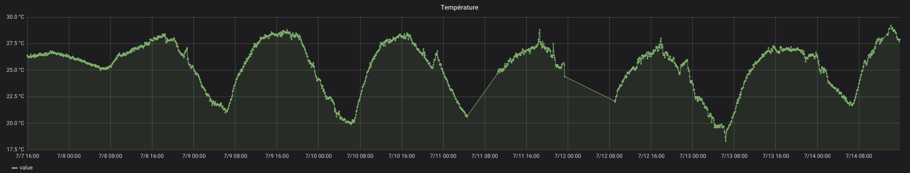

# xiaomi-mijia-bluetooth-to-prometheus
A Python3 webserver aimed for Linux, exposing Xiaomi Mijia Bluetooth measures in the Prometheus format.

[](https://travis-ci.com/sdenel/xiaomi-mijia-bluetooth-to-prometheus)

An example with Grafana reading the Prometheus DB:




# Installation

## Connecting the probe for the first time
First, connect the probe to your computer:
```bash
sudo hcitool lecc YOUR_PROBE_MAC_ADDRESS
```
## Running the webserver
Then, launch the web server as a background task, using tmux for example:
```bash
# Tip: Ctrl+b, d to detach the session
tmux new -s xiaomi-mijia-bluetooth-to-prometheus "./webserver.py"
```

## Configuring Prometheus
Example of job configuration:
```yaml
  - job_name: "xiaomi-mijia-bluetooth"
    static_configs:
    - targets:
      - "172.17.0.1:9191"
```

# Tests
See also .travis.yml.
```bash
# pep install pycodestyle
pycodestyle --first webserver.py
python3 -m doctest -v webserver.py
```
